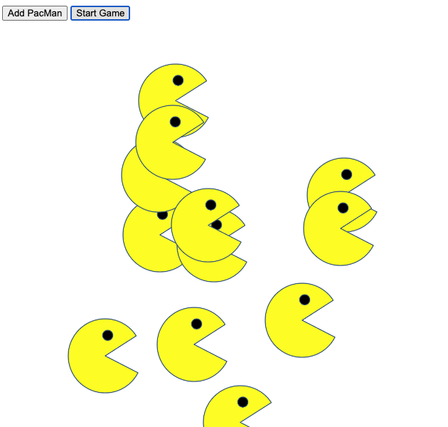

# Pacmen
## Add Pacmen to the screen and then watch them go  
 
In this version, the user can add Pac-men to the screen with a button click, and another button puts them all into motion at random speeds, moving in two dimensions along both the x- and y-axes, reversing directions when they reach the edge of the window. I'm currently working on getting the Pacmen to open and close their mouths and change their images dynamically to the correct direction when they hit the right and left sides of the window. Those initial attempts are included as comments, but I haven't yet completed that part of the code. As it is now, the Pacmen move about the screen as a static image, facing right with their mouths open.

To use the application, click "Add PacMan" to add a Pacman to the screen, then click "Start Game" to set them in motion. You can continue to add Pacmen to the screen with the "Add PacMan" button after the game has been started.

---
MIT License

Copyright (c) 2022 Julie Strand

Permission is hereby granted, free of charge, to any person obtaining a copy
of this software and associated documentation files (the "Software"), to deal
in the Software without restriction, including without limitation the rights
to use, copy, modify, merge, publish, distribute, sublicense, and/or sell
copies of the Software, and to permit persons to whom the Software is
furnished to do so, subject to the following conditions:

The above copyright notice and this permission notice shall be included in all
copies or substantial portions of the Software.

THE SOFTWARE IS PROVIDED "AS IS", WITHOUT WARRANTY OF ANY KIND, EXPRESS OR
IMPLIED, INCLUDING BUT NOT LIMITED TO THE WARRANTIES OF MERCHANTABILITY,
FITNESS FOR A PARTICULAR PURPOSE AND NONINFRINGEMENT. IN NO EVENT SHALL THE
AUTHORS OR COPYRIGHT HOLDERS BE LIABLE FOR ANY CLAIM, DAMAGES OR OTHER
LIABILITY, WHETHER IN AN ACTION OF CONTRACT, TORT OR OTHERWISE, ARISING FROM,
OUT OF OR IN CONNECTION WITH THE SOFTWARE OR THE USE OR OTHER DEALINGS IN THE
SOFTWARE.
